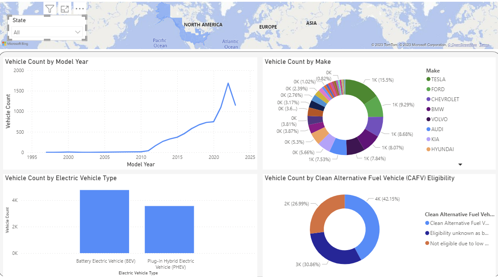
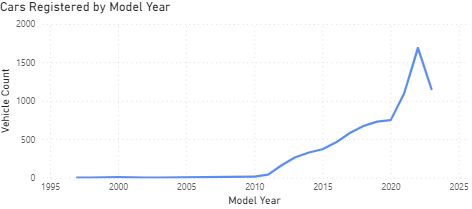
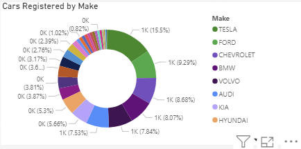
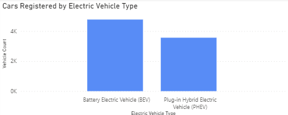
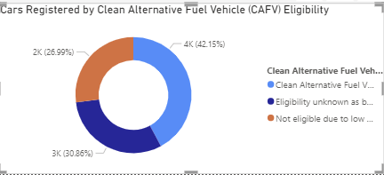

# Visualizing-US-Electric-Vehicle-Population-Data-with-PowerBI
This project visualizes United States population data.
## Data Understanding
This dataset shows the Battery Electric Vehicles (BEVs) and Plug-in Hybrid Electric Vehicles (PHEVs) that are currently registered through the Washington State Department of Licensing (DOL). it includes variables such as the model year of the vehicle, the make of the vehicle, the range(i.e. distance they can travel), the type of EV (i.e. Battery Electric Vehicle or Plug-in Hybrid Electric Vehicle), and whether a vehicle is eligible as a clean alternative fuel vehicle. 
[Data Source](https://www.kaggle.com/datasets/utkarshx27/electric-vehicle-population-data?resource=download)
## Visualising the Data
A dashboard is created showing an overview of electric vehicles registered through the Washington State Department of Licensing (DOL). 
[dashboard](https://app.powerbi.com/view?r=eyJrIjoiNzhmOGY2YTgtNWE4ZS00ZjA2LTk4MDQtODUxNjA5MGFkM2RiIiwidCI6IjUxYTBhNjljLTBlNGYtNGIzZC1iNjQyLTEyZTAxMzE5ODYzNSIsImMiOjh9)    

There are four main charts in the dashboard. The first chart shows the number of cars registered by model year. Overall, There are more cars registered with model year 2022 than any other year.  

  
The second chart shows the number of cars registered by make (manufacturer). Tesla has more cars registered than any other manufacturer.  

  
The third chart shows the cars registered by the type of electric vehicle. There are more battery electric vehicles than plug-in hybrid electric vehicles.  

  
The last chart shows the ratio of electric cars registered that are eligible as a clean alternative fuel vehicle as against those that are not.  

  

